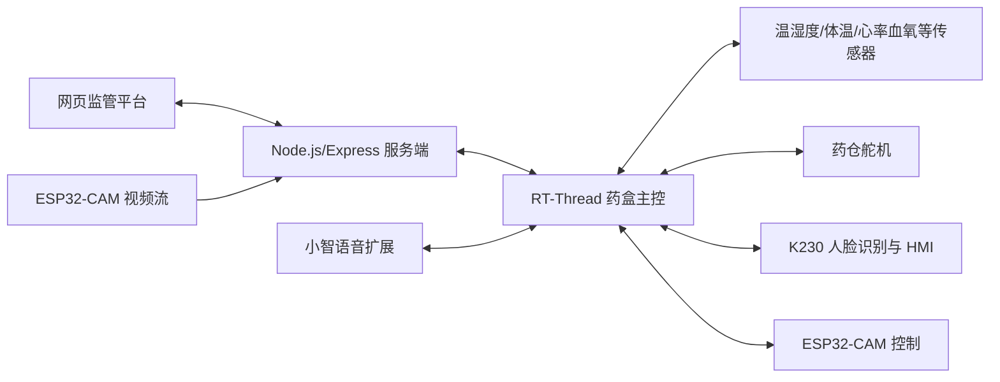

# qiansai-medication-terminal

基于状态感知的智能安全用药药盒监管终端项目，包含 RT-Thread 主控应用、ESP32-CAM 图像采集、K230 人脸识别与串口屏交互、网页监管平台以及小智语音/设备控制扩展代码。

本仓库当前以模块压缩包形式归档，便于按硬件端、视觉端、网页端和语音交互端分别导入到对应开发环境。

## 项目模块

| 文件 | 模块 | 说明 |
| --- | --- | --- |
| `applications.zip` | RT-Thread 主控应用 | 智能药盒主控业务代码，包含传感器采集、LCD 显示、蜂鸣器提醒、药仓舵机控制、K230 鉴权联动、ESP32-CAM 控制、本地服务端上传等功能。 |
| `esp32_camera_mjpeg_multiclient (2).zip` | ESP32-CAM 摄像头端 | 基于 AI-Thinker ESP32-CAM 的 MJPEG 多客户端视频流服务，并支持向服务端推送摄像头帧。 |
| `k230.zip` | K230 视觉识别端 | K230/CanMV 侧人脸注册、人脸识别、串口状态机、HMI 串口屏刷新和药仓信息展示逻辑。 |
| `webpage.zip` | 网页监管平台 | Vue 单页前端和 Node.js/Express 后端，提供登录注册、设备状态、健康检测、用药计划、药仓管理、摄像头监控和家属监管等功能。 |
| `xiaozhi.zip` | 小智扩展 | 小智/ESP-IDF 相关应用扩展，包含 UART 指令通道、MCP 工具映射、用药流程语音交互和设备控制逻辑。 |

## 功能概览

- 药盒终端状态采集：温湿度、体温、心率血氧、药仓状态等数据采集与上报。
- 用药提醒与安全控制：蜂鸣器提醒、LCD 状态展示、舵机开仓、服药确认和异常预警。
- 身份识别：K230 端支持人脸注册/识别，并通过 UART 与主控联动。
- 摄像头监管：ESP32-CAM 支持本地 MJPEG 访问和远程帧推送，网页端可查看摄像头状态。
- Web 管理平台：支持账号认证、用药计划、药品库、用药记录、药仓库存、系统阈值和家属联系方式管理。
- 语音交互扩展：小智模块通过 UART/MCP 命令与药盒主控交互，支持开盖、取药、放药、健康检测和通信类指令。

## 目录使用方式

1. 下载或克隆仓库。
2. 根据需要解压对应模块。
3. 将解压后的代码导入到对应开发环境：
   - `applications.zip`：导入 RT-Thread Studio 或已有 RT-Thread 工程的 `applications` 目录。
   - `esp32_camera_mjpeg_multiclient (2).zip`：使用 Arduino IDE 或兼容 ESP32-CAM 的开发环境打开 `.ino` 文件。
   - `k230.zip`：放入 K230/CanMV MicroPython 工程环境，结合板端模型、`libs` 依赖和 SD 卡目录使用。
   - `webpage.zip`：解压后进入 `webpage` 目录，安装 Node.js 依赖并启动后端/前端工程。
   - `xiaozhi.zip`：合并到对应小智 ESP-IDF 工程源码目录，按工程配置启用 UART 命令能力。

## 配置说明

发布到仓库前，示例代码中的私人配置已替换为占位符。实际部署前需要在本地重新配置：

- Wi-Fi SSID 和密码。
- 服务端公网或局域网地址。
- ESP32-CAM 推流密钥。
- Web 平台默认账号、默认密码和 `AUTH_SECRET`。
- RT-Thread 主控与 K230、小智、串口屏之间的 UART 端口、波特率和引脚。
- K230 模型文件、用户数据、药仓数据等板端运行资源。

建议把真实密钥、密码和服务器地址放在本地配置文件、环境变量或私有部署配置中，不要提交到公开仓库。

## Web 平台运行提示

`webpage.zip` 中包含 `server.js`，后端依赖 Express、Socket.IO、CORS、dotenv 和 OpenAI SDK 等 Node.js 包。解压后可按项目实际的 `package.json` 或本地工程配置安装依赖并启动服务。

服务端运行时会在 `webpage/data` 下维护用户、药品库、系统设置等 JSON 数据，并在 `webpage/uploads/medicine-videos` 下保存摄像头相关视频或帧数据。

## 硬件与通信关系

## 注意事项

- 仓库中的模块是按压缩包归档的阶段性代码，若要长期维护，建议后续解压为源码目录并补充统一的构建脚本。
- 部分模块依赖具体硬件引脚、串口号、服务器接口和板端模型文件，迁移到新设备时需要同步调整配置。
- 公开仓库不要提交真实账号、密码、家庭 Wi-Fi、短信/电话配置、服务器密钥或任何个人隐私数据。

